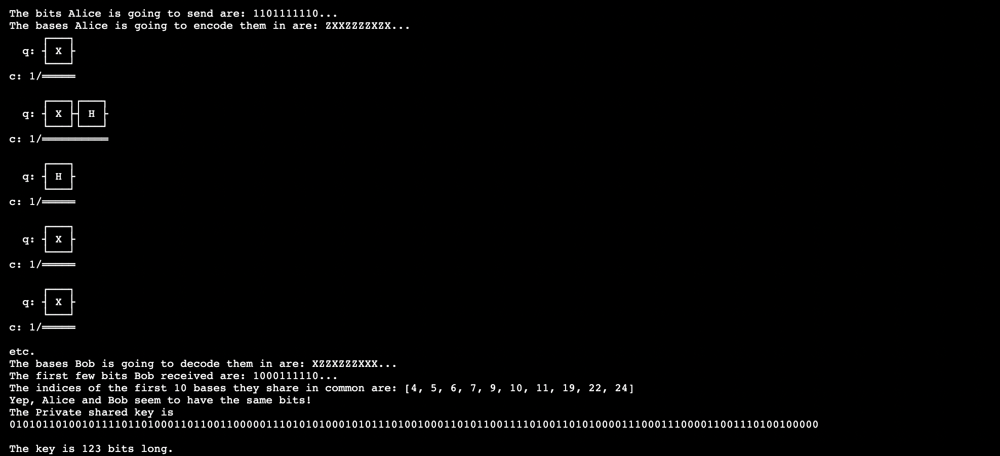

# BB84-Protocol-QKD

QKD stands for Quantum Key Distribution

## Inspiration  

  Cryptography has been playing a vital role in some or other way to perform safe and secure communication. Although with advancment of technology cryptography techniquies are advancing day by day, but also with these advancment techniques to outcast these techniques are also been developed.

   Many of these encryption techniques fall under the category of Symmetric Key Cryptography, in which each party is given a key which contains the instructions for encrypting and decrypting the message. Let's say the key contains the instructions to replace every letter of the alphabet with a corresponding number. This key could just be a string of bits (0s and 1s) encoding the instructions for encryption and decryption.

  Let’s assume that, as long as Alice and Bob share a secret key, they are able to securely encrypt their messages in a way that would be impossible to decrypt without this key. So, if Eve taps into their communication channel and reads their messages, she would have no idea what the messages say, since she wouldn’t know the key used to encrypt and decrypt them.

   Of course, to set up this encrypted channel, Alice and Bob need to communicate in secret to come up with a key. But this kind of secure communication requires an encrypted channel, which we will try to create using BB84 QKD Protocol.

## The BB84 Protocol

Let's assume two party, Alice and Bob want have a secure connection and ensure that there is no intercepted( assume Eve .

   Here’s how the protocol will work in a nutshell:

   1. Alice creates a random string of bits, and for each bit, she randomly chooses a basis to encode it in.
       
   2.Alice encodes the bits into qubits using her chosen bases, and sends the qubits over a quantum communication channel to Bob’s quantum computer.
    
   3. Bob also randomly chooses a basis to decode each qubit in. He measures each qubit in the bases he chose.

   4.Alice uses a classical communication channel to tell Bob which bases she chose. She also tells him the first few bits she sent.
    
   5.Bob analyzes these first few bits to determine whether Eve tapped into their quantum communication channel and intercepted Alice’s qubits.

   6. If Eve did not intercept the qubits, they consider all of the qubits that they happened to choose the same bases for, and use those bits as their key. If Eve did intercept the qubits, they repeat the process all over again.

## Result

